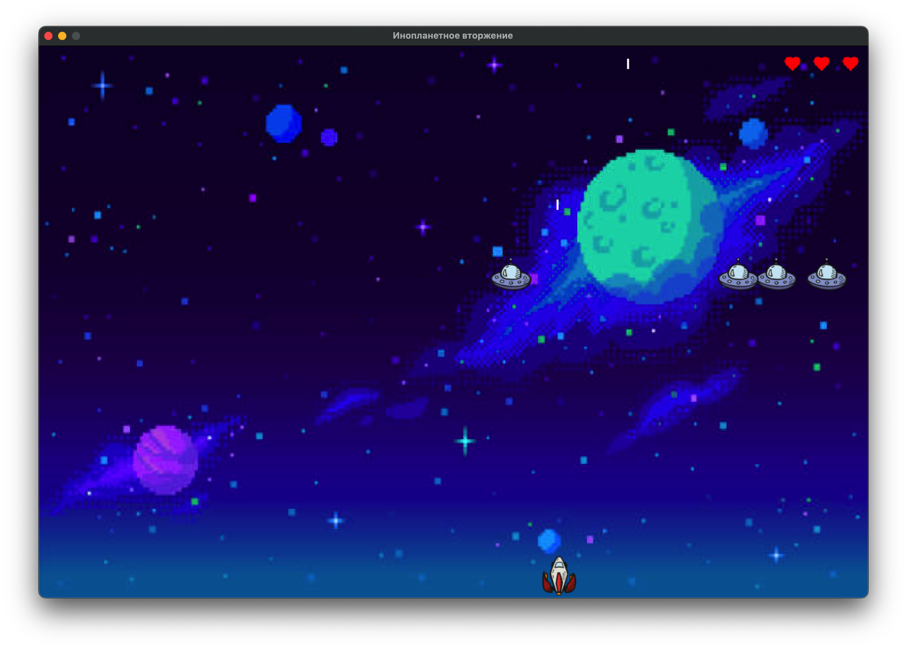

# Инопланетное вторжение (Практическая работа №2)



## Описание

"Инопланетное вторжение" — это классическая аркадная игра, в которой вы управляете космическим кораблём, защищая Землю от нашествия инопланетян. Ваша задача — уничтожить как можно больше врагов, избегая их атак и сохраняя своё здоровье. Игра реализована с использованием библиотеки `pygame`.

## Особенности

- Управление кораблём: движение влево и вправо, стрельба.
- Флот инопланетян, который постепенно приближается к вам.
- Система здоровья, отображаемая в виде сердечек.
- Возможность сохранения и загрузки игры.
- Увеличение уровня сложности после уничтожения всех врагов.
- Игровой счёт и уровень отображаются на экране.

## Управление

- **Стрелка влево (←)**: Движение корабля влево.
- **Стрелка вправо (→)**: Движение корабля вправо.
- **Пробел**: Стрельба.
- **S**: Сохранить игру.
- **L**: Загрузить игру.
- **Q**: Выйти из игры.

## Установка

1. Установите зависимости:

```bash
poetry install
```

2. Активируйте env среду:

```bash
poetry shell
```

3. Запустите проект:

```bash
python main.py
```

---

Удачи в защите Земли от инопланетного нашествия! 🚀👾
